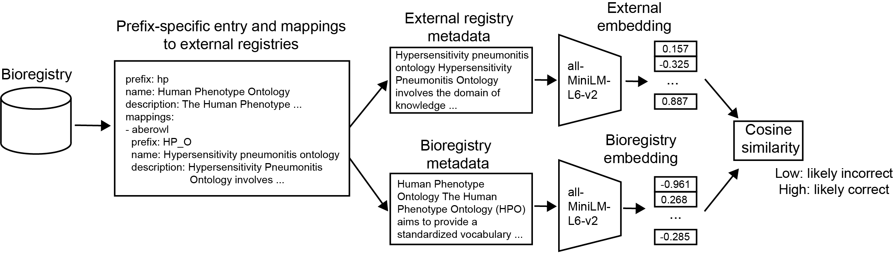

# Embeddings-based checking of mapped prefixes

The output for this workflow on all prefixes is available in
([`mapping_embedding_similarities.tsv`](mapping_embedding_similarities.tsv)).
The columns of this file are as follows:

- prefix: The Bioregistry prefix from which this is a mapping.
- mapped_registry: The external registry to which this is a mapping.
- mapped_prefix: The external registry's prefix to which this is a mapping.
- reference_text: The concatenated metadata text from the Bioregistry consensus,
  serving as reference.
- external_text: The concatenated metadata text from the external registry.
- parts_used: The metadata fields that were used (depending on availability) to
  construct the external text.
- known_mismatch: 1 if this is a mismatch curated in mismatch.json, 0 otherwise.
- similarity: The similarity score between 0 and 1 (due to numerical accuracy
  score is sometimes outside these ranges by a very small margin).
