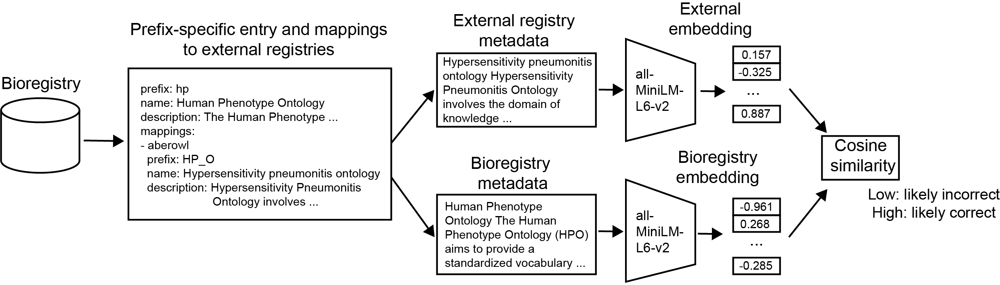

# Embeddings-based checking of mapped prefixes

This workflow outputs predicted mappings in the
[Simple Standard for Sharing Ontological Mappings (SSSOM)](https://mapping-commons.github.io/sssom/dev/)
format in
[`mapping_embedding_similarities.sssom.tsv`](mapping_embedding_similarities.sssom.tsv).

The columns of this file are as follows:

- [`subject_id`](https://w3id.org/sssom/subject_id): a CURIE representing
  Bioregistry prefix from which this is a mapping.
- [`subject_label`](https://w3id.org/sssom/subject_label): the name of the
  resource in the Bioregistry
- [`predicate_id`](https://w3id.org/sssom/predicate_id): always
  `skos:exactMatch`
- [`object_id`](https://w3id.org/sssom/object_id): a CURIE representing the
  prefix in the external registry
- [`object_label`](https://w3id.org/sssom/object_label): the name of the
  resource in the external registry
- [`mapping_justification`](https://w3id.org/sssom/mapping_justification):
  always `semapv:LexicalMatching`
- [`similarity_score`](https://w3id.org/sssom/similarity_score): The similarity
  score between 0.0 and 1.0
- `parts_used`: The metadata fields that were used (depending on availability)
  to construct the external text.
- `reference_text`: The concatenated metadata text from the Bioregistry
  consensus, serving as reference.
- `mapping_text`: The concatenated metadata text from the external registry.

`parts_used`, `reference_text`, and `mapping_text` are defined as
[extension slots](https://mapping-commons.github.io/sssom/dev/spec-model/#defined-extensions)
in SSSOM.
