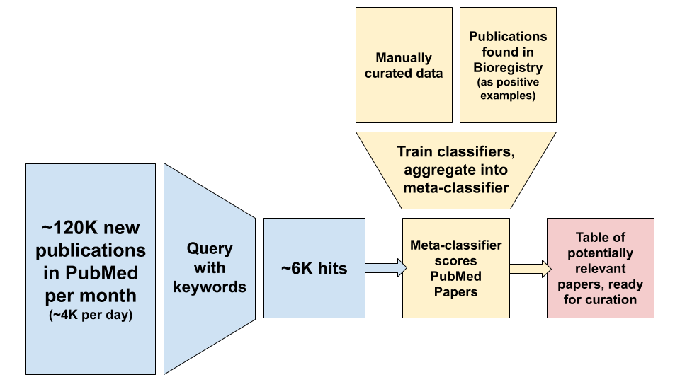

# Title TF-IDF Analysis

We searched for articles published in 2021 indexed in PubMed that contained one
of the following in its title:

1. database
2. ontology
3. vocabulary
4. nomenclature
5. resource

Of the resulting articles, we curated a random 10% as relevant or not based on
title. We featurized these titles using term frequency-inverse document
frequency (TF-IDF), trained/evaluated a binary classifier, then predicted scores
for the remaining publications ([`predictions.tsv`](predictions.tsv)). These can
be directly curated either by

1. Add the publication to an existing prefix
2. Make a
   [new prefix request](https://github.com/biopragmatics/bioregistry/issues/new/choose)
   for the identifier resource described by the article

For reference, the relative importance of each feature(i.e., word) is available
in [`importances.tsv`](importances.tsv). This analysis can be re-run with
`python -m bioregistry.analysis.title_tfidf`. A
[presentation](https://bit.ly/wpci2022-bioregistry-maintenance) on this workflow
was given at the
[2022 Workshop on Prefixes, CURIEs, and IRIs](https://biopragmatics.github.io/workshops/WPCI2022).
