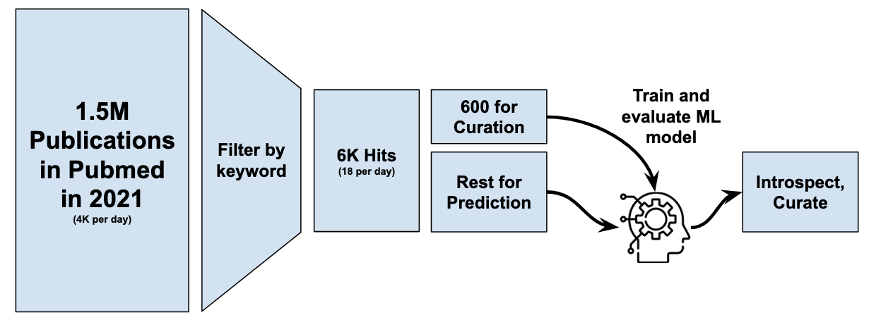

# Title TF-IDF Analysis

We searched for articles published in 2021 indexed in PubMed that contained one of the following in its title:

1. database
2. ontology
3. vocabulary
4. nomenclature
5. resource

Of the resulting articles, we curated a random 10% as relevant or not based on title. We featurized these titles
using term frequency-inverse document frequency (TF-IDF), trained/evaluated a binary classifier, then predicted
scores for the remaining publications ([`predictions.tsv`](predictions.tsv)). The relative importance of each feature
(i.e., word) is available in [`importances.tsv`](importances.tsv).
