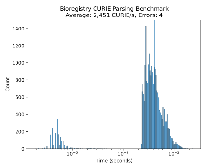

# CURIE Parsing Benchmark

This benchmark checks the `bioregistry.parse_curie` function.

## Dataset

The benchmarking dataset is available in [`data.tsv`](data.tsv). It contains the
following columns:

1. `prefix` - a canonical Bioregistry prefix
2. `identifier` - a local unique identifier in the prefix's semantic space
3. `prefix_synonym` - the synonym of the canonical prefix being used
4. `banana` - the banana being used (i.e., redundant prefix in local identifier)
5. `curie` - the CURIE for the prefix_synonym-banana-identifier triple

Example data:

| prefix        | identifier   | prefix_synonym | banana | curie                      |
| ------------- | ------------ | -------------- | ------ | -------------------------- |
| 3dmet         | B00162       | 3dmet          |        | 3dmet:B00162               |
| 4dn.biosource | 4DNSR73BT2A2 | 4DN            |        | 4DN:4DNSR73BT2A2           |
| 4dn.biosource | 4DNSR73BT2A2 | 4dn.biosource  |        | 4dn.biosource:4DNSR73BT2A2 |
| 4dn.replicate | 4DNESWX1J3QU | 4dn.replicate  |        | 4dn.replicate:4DNESWX1J3QU |
| abcd          | AD834        | abcd           |        | abcd:AD834                 |
| cco           | 0000003      | cco            |        | cco:0000003                |
| cco           | 0000003      | cco            | CCO:   | cco:CCO:0000003            |

## Results

Most parsing goes pretty fast (average around 4,000 CURIE/second).

