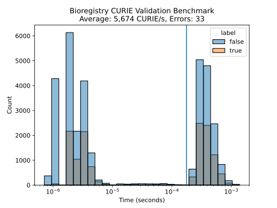

# CURIE Validation Benchmark

This benchmark checks the `bioregistry.is_valid_curie` function.

## Dataset

The benchmarking dataset is available in [`data.tsv`](data.tsv). It contains the
following columns:

1. `prefix` - a canonical Bioregistry prefix
2. `identifier` - a local unique identifier in the prefix's semantic space
3. `label` - either `true` if the combination is a valid and standard CURIE
   (w.r.t. the Bioregistry) or `false` if not
4. `curie` - the CURIE for the prefix-identifier pair

Example data:

| prefix        | identifier   | label | curie                      |
| ------------- | ------------ | ----- | -------------------------- |
| 3dmet         | B00162       | true  | 3dmet:B00162               |
| 4dn.biosource | 4DNSR73BT2A2 | false | 4DN:4DNSR73BT2A2           |
| 4dn.biosource | 4DNSR73BT2A2 | true  | 4dn.biosource:4DNSR73BT2A2 |
| 4dn.replicate | 4DNESWX1J3QU | true  | 4dn.replicate:4DNESWX1J3QU |
| abcd          | AD834        | true  | abcd:AD834                 |

## Results

