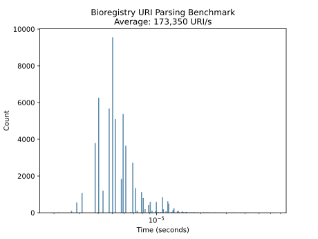

# URI Parsing Benchmark

This benchmark checks the `bioregistry.parse_iri` function. See also
https://github.com/biopragmatics/bioregistry/pull/481.

## Dataset

The benchmarking dataset is available in [`data.tsv`](data.tsv). It contains the
following columns:

1. `prefix` - a canonical Bioregistry prefix
2. `identifier` - a local unique identifier in the prefix's semantic space
3. `metaprefix` - the metaprefix for the provider (i.e., `n2t` for
   Name-to-Thing)
4. `uri` - the URI for the metaprefix-prefix-identifier triple

Example data:

| prefix        | identifier   | metaprefix  | uri                                                           |
| ------------- | ------------ | ----------- | ------------------------------------------------------------- |
| 3dmet         | B00162       | bioregistry | https://bioregistry.io/3dmet:B00162                           |
| 3dmet         | B00162       | default     | http://www.3dmet.dna.affrc.go.jp/cgi/show_data.php?acc=B00162 |
| 3dmet         | B00162       | miriam      | https://identifiers.org/3dmet:B00162                          |
| 3dmet         | B00162       | n2t         | https://n2t.net/3dmet:B00162                                  |
| 4dn.biosource | 4DNSR73BT2A2 | bioregistry | https://bioregistry.io/4dn.biosource:4DNSR73BT2A2             |

## Results

Most parsing goes pretty fast (average above 1,000 URI/second).

