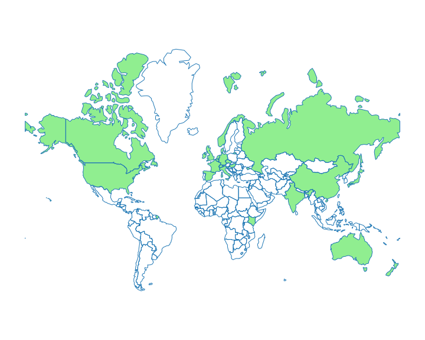

# Geography

This chart aggregates the countries of the institutions responsible for
resources indexed in the Bioregistry.

Note, that this information is not required and is therefore missing for a large
number of entries. If you want to help curate this information, see
[this curation guide](https://biopragmatics.github.io/bioregistry/curation/organizations).

