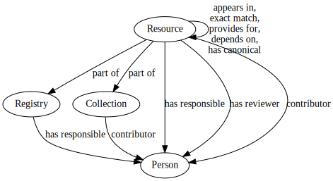

# RDF Exports

The RDF dump of the Bioregistry combines information about the registry,
metaregistry, and collections using the schema described at
https://bioregistry.io/schema/. Elements of the Bioregistry schema have the
prefix
[`bioregistry.schema`](https://bioregistry.io/registry/bioregistry.schema).

## Schema

The schema of the RDF dump can be downloaded in several formats, or as an
auto-generated diagram. Note that it only shows class relationships and not the
properties associated with each class, nor specific instances of each.

| File Name                        | Format                                                              |
| -------------------------------- | ------------------------------------------------------------------- |
| [`schema.jsonld`](schema.jsonld) | The schema of the RDF dump in the JSON Linked Data (JSON-LD) format |
| [`schema.nt`](schema.nt)         | The schema of the RDF dump in the N-Triples format                  |
| [`schema.ttl`](schema.ttl)       | The schema of the RDF dump in the turtle format                     |
| [`schema.svg`](schema.svg)       | A diagram of the schema in SVG                                      |
| [`schema.pdf`](schema.pdf)       | A diagram of the schema in PDF                                      |

## Full Export

The full RDF dump can be downloaded here in several formats.

| File Name                                  | Format                                                                            |
| ------------------------------------------ | --------------------------------------------------------------------------------- |
| [`bioregistry.jsonld`](bioregistry.jsonld) | The full RDF dump (including the schema) in the JSON Linked Data (JSON-LD) format |
| [`bioregistry.nt`](bioregistry.nt)         | The full RDF dump (including the schema) in the N-Triples format                  |
| [`bioregistry.ttl`](bioregistry.ttl)       | The full RDF dump (including the schema) in the turtle format                     |
